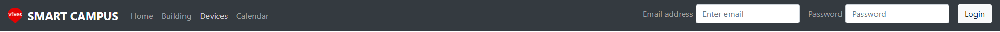
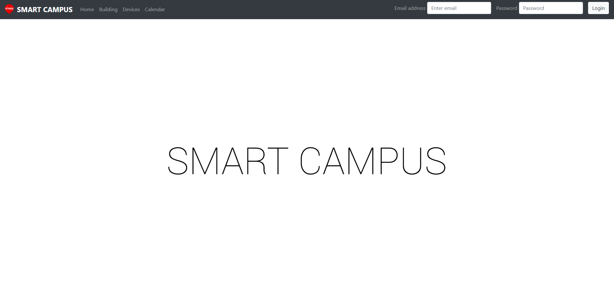
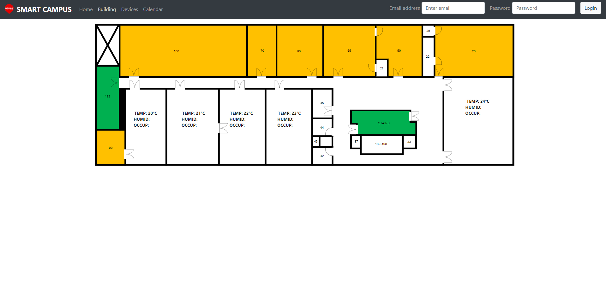
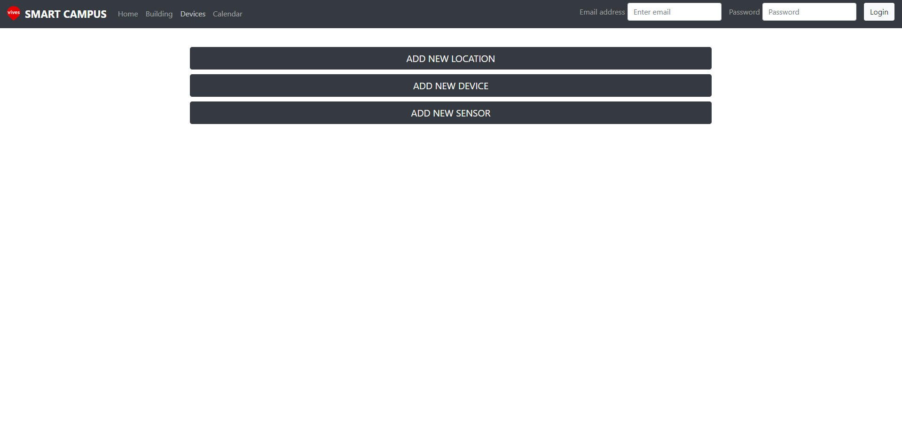
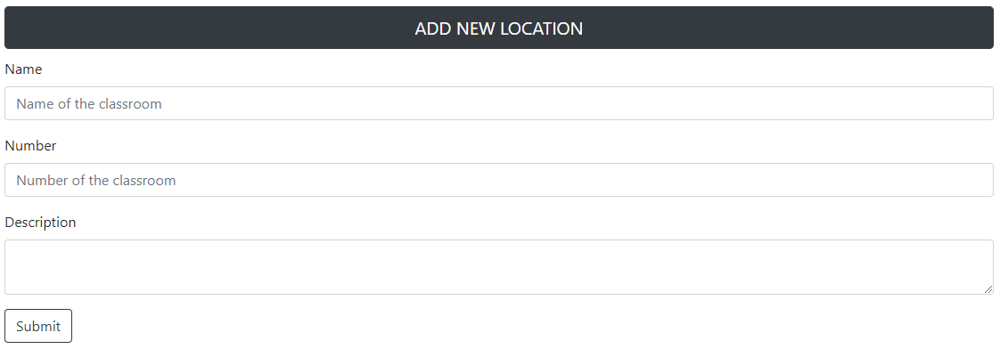
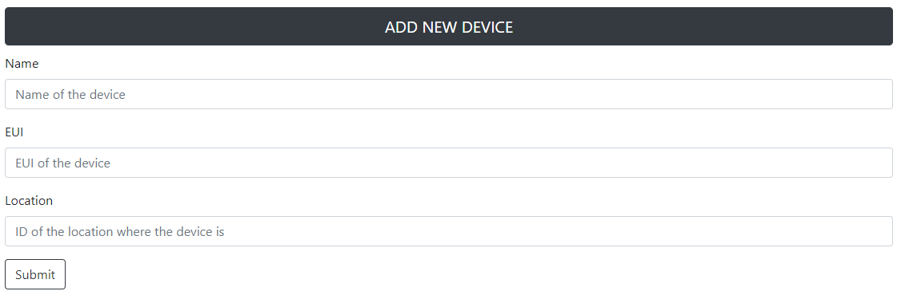
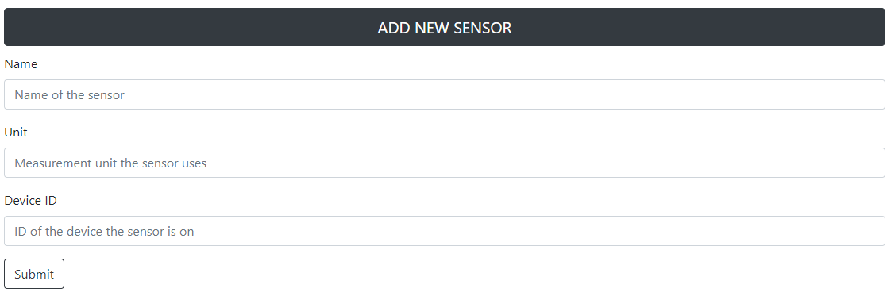

# SMART CAMPUS FRONTEND

This repo contains the frontend of the Smart Campus web-app.
It was created in NodeJS with the React framework. It uses third party libraries.

## Installation and start

Install the app with:

```bash
$ npm install
$ git clone git@github.com:Projectwerk2-2018/smart-campus-frontend.git
```

Start the app with:

```bash
$ cd smart-campus-frontend
$ npm start
```

To view app then go to **http://localhost:3000/**

## Dependencies

Usage of third party libraries: bootstrap v.4, react-router, axios, react-highcharts and react-image-mapper.

## NAVIGATION

The webapp has a navbar located at the top of the screen.



The components from left to right:
* Vives University logo (onClick sends back to homepage)
* Webapp name (onClick sends back to homepage)
* Home (onClick sends back to homepage)
* Building (onClick sends to the building section)
* Devices (onClick sends to the devices section)
* Calendar (onClick sends to the calendar section)
* Email address (form to fill with login email)
* Password (form to fill with login password)
* Login (onClick submits the login form)

## HOME

Introduction homescreen of the web-app.



## BUILDING

Interactive floor plan of the KU Leuven campus building.



Rooms 85, 80, 75, 65 and 01 are interactive. onClick shows historical data in form of a graph underneath the floor plan.
They show the most recent temperature, humidity and occupancy in the room.

## DEVICES

Forms for adding new locations, devices and sensors.



### New location

Name:
>   name of the new location
Number:
>   number of the room the new location represents
Description:
>   short informative description of the room

### New Device

Name:
>   name of the new device
EUI:
>   eui that belongs to the new device

### New sensor

Name:
>   name of the new sensor
Unit:
>   unit in which the new sensor gathers data

> TODO -> User has to be logged in in order to access this module. Changes can only be done by admin.

## CALENDAR

> TODO -> Add calendar component.

> TODO -> Add ability to create and delete events in the calendar.

> TODO -> Authorization needed to access this module.